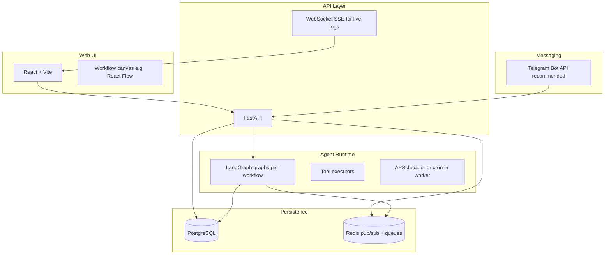

# AI Agent Orchestration Platform — Implementation Plan

Source: [AI Orchestration.pdf](AI%20Orchestration.pdf) (3 pages, **AI Engineer Hiring Challenge**). Your choices: **LangGraph** runtime; messaging channel **TBD** (recommend **Telegram** below).

---

## What you are building (spec summary)

| Area | Requirement |
|------|-------------|
| Core | Users create agents, configure behavior (personality, tools, schedules, memory, limits), wire them into collaborative workflows |
| Runtime | Real execution — not a UI mockup; integrate **LangGraph** |
| Communication | Agents talk **asynchronously**; history **persisted** and visible in UI |
| Human channel | At least one agent on **WhatsApp, Telegram, or Slack** |
| UI | Web UI to manage everything visually |
| Local | Runs fully local with **single setup command** (Docker Compose recommended) |
| Deliverables | Working repo, README (architecture + run), **video/GIF demo** (incl. live messaging), live code walkthrough |

**Evaluation weights:** end-to-end demo **40%** · architecture/code **30%** · UI/UX **20%** · docs **10%**

---

## Recommended stack (aligned with LangGraph + local-first)



| Layer | Choice | Why |
|-------|--------|-----|
| Backend | **Python 3.11+**, **FastAPI** | Native LangGraph/LangChain ecosystem |
| Frontend | **React + TypeScript + Vite** | Fast UI; React Flow for visual workflows |
| DB | **PostgreSQL** | Agents, workflows, messages, runs, token usage |
| Queue / async | **Redis** + worker process | Agent-to-agent async; job queue for runs |
| Local run | **`docker compose up`** | One command: API, worker, UI, Postgres, Redis |
| Channel | **Telegram** (recommended) | Simple Bot API, polling works locally without ngrok; Slack is second-easiest (Socket Mode) |

---

## Phased steps (how to proceed)

### Phase 0 — Foundation (Day 1)

1. **Scaffold monorepo** under [AI-Orchestrator](.)
   - `backend/` (FastAPI, LangGraph, Alembic)
   - `frontend/` (Vite React)
   - `docker-compose.yml`, `Makefile` or `scripts/dev.sh` → single entry: `make up`
   - `.env.example` (OpenAI/Anthropic API key, DB URL, Redis, `TELEGRAM_BOT_TOKEN`, etc.) — keep [.env](.env) gitignored

2. **Data model** (Postgres + migrations)
   - `agents`: name, role, system_prompt, model, tools (JSON), channels (JSON), config blob (schedules, memory, skills, rules, guardrails)
   - `workflows`: name, definition JSON (graph nodes/edges), version
   - `workflow_templates`: seed **≥2 pre-built templates**
   - `runs` / `run_steps`: status, timestamps, token/cost fields
   - `messages`: sender (agent/human/system), channel, thread_id, content, metadata — **all inter-agent + external traffic**

3. **README skeleton**: problem, stack justification (**why LangGraph**), architecture diagram placeholder

---

### Phase 1 — Agent CRUD + configuration API (Days 2–3)

4. **REST API** for agents
   - CRUD: name, role, system prompt, model, tools, channels
   - Extended config: schedules, memory policy, skills, interaction rules, guardrails (store as structured JSON; validate with Pydantic)

5. **Tool registry** (minimum viable real tools)
   - e.g. `web_search` (or fetch URL), `calculator`, `read_file` / `write_note` — enough for a credible demo task
   - Map tool names → LangGraph tool nodes per agent

6. **Tests (critical path #1)**: agent create/update/delete; config round-trip

---

### Phase 2 — LangGraph runtime + async execution (Days 4–6)

7. **Workflow compiler**: UI/API graph JSON → LangGraph `StateGraph`
   - Node types: `agent`, `condition`, `human_input` (optional), `end`
   - Support **conditions** and **feedback loops** (cycles with max-iteration guardrail)

8. **Run orchestrator** (worker service)
   - Enqueue run → build graph from workflow + agent configs → execute
   - **Async agent messaging**: agents post to shared state / Redis channels; persist each message before next step
   - Emit events for UI: step started, message sent, tool called, completed/failed

9. **Memory**: per-agent conversation + workflow run context (DB + LangGraph checkpointer or custom store)

10. **Schedules** (MVP): cron-like triggers stored on agent; worker picks due jobs and starts runs

11. **Tests (critical path #2)**: two-agent workflow executes; messages persisted in order

---

### Phase 3 — Web UI (Days 7–9)

12. **Agent management pages**
    - List/create/edit agents; all configurable dimensions visible (group into tabs: Identity, Tools, Memory, Schedule, Guardrails, Channels)

13. **Visual workflow builder**
    - Drag-drop nodes and edges (React Flow)
    - Condition editor on edges; save to API

14. **Workflow templates gallery**
    - Ship **≥2 templates**, e.g.:
      - **Research → Writer**: Researcher gathers facts → Writer produces summary
      - **Planner → Executor → Reviewer**: Plan task → execute with tools → review output

15. **Live monitoring**
    - Run list + detail: real-time logs (SSE/WebSocket), inter-agent message timeline, token/cost per step/run

16. **Message history UI**: filter by run, agent, channel; show full thread

---

### Phase 4 — External messaging (Days 10–11)

**Recommendation: Telegram** (you were undecided)

17. **Telegram integration**
    - Register bot via [@BotFather](https://t.me/BotFather)
    - Webhook (prod) or **long polling** (local dev) in worker/API
    - Map `chat_id` → bound agent + optional workflow thread
    - Inbound user message → trigger agent (or resume graph) → reply on Telegram

18. **Bind agent to channel** in UI: select agent + Telegram as channel; store chat mapping

19. **Tests (critical path #3)**: inbound Telegram message creates persisted row and gets agent response

---

### Phase 5 — Demo, docs, polish (Days 12–14)

20. **End-to-end demo script** (matches 40% weight)
    - Create 2 agents from UI
    - Load a template workflow, run it on a real task (e.g. “Summarize latest news about X”)
    - Show live monitor: logs + inter-agent messages + token counts
    - Open Telegram: have a **live conversation** with the connected agent

21. **Record demo**: screen capture or GIF; link in README

22. **README completion**
    - Architecture diagram (Mermaid)
    - `make up` / env vars
    - **LangGraph justification** vs CrewAI/AutoGen/openclaw
    - **Channel setup** (Telegram steps)
    - How to add a new workflow template
    - How to add a new messaging channel (adapter interface)

23. **Code quality pass**
    - Clear separation: `frontend/` | `backend/api/` | `backend/runtime/` | `backend/persistence/` | `backend/channels/`
    - Lint/format (ruff, eslint)
    - Remaining tests on message delivery and workflow happy path

---

## Success criteria checklist (from PDF)

**Functional**
- [ ] Agent CRUD + full configuration surface
- [ ] Visual workflow builder with conditions + feedback loops
- [ ] ≥2 workflow templates
- [ ] WhatsApp / Telegram / Slack — **at least one** (plan: Telegram)
- [ ] Live monitoring: logs, inter-agent messages, token/cost
- [ ] Demo: **2+ agents**, real task, real tools, async comms

**Non-functional**
- [ ] Responsive enough for demo (no hard perf SLAs)
- [ ] Single local setup command
- [ ] Tests on agent creation, workflow execution, message delivery
- [ ] README with diagram + extension guides

---

## LangGraph-specific design notes

- **One graph per workflow run**, with **subgraphs or nodes per agent** — each node loads agent system prompt, tools, guardrails from DB.
- Use **checkpointer** (e.g. Postgres-backed) for resumable runs and demo reliability.
- **Guardrails**: max iterations, tool allowlist, output length — enforce in graph edges and pre-tool hooks.
- **Cost tracking**: wrap LLM calls; accumulate `prompt_tokens` / `completion_tokens` on `run_steps`.

---

## Risk mitigations

| Risk | Mitigation |
|------|------------|
| Scope creep | MVP channel = Telegram only; WhatsApp/Slack as README “future adapter” |
| Async complexity | Redis list/stream for agent mailbox; single writer per run |
| Demo flakiness | Pre-seed templates; scripted demo path + fallback API keys |
| Live walkthrough | Keep graph definitions readable; document tradeoffs in README |

---

## Suggested repo layout (target)

```
AI-Orchestrator/
├── docker-compose.yml
├── Makefile
├── .env.example
├── README.md
├── backend/
│   ├── app/main.py
│   ├── api/routes/          # agents, workflows, runs, messages
│   ├── models/              # SQLAlchemy
│   ├── runtime/             # LangGraph compile + execute
│   ├── channels/telegram.py
│   └── worker.py
├── frontend/
│   └── src/                 # pages, workflow canvas, monitor
└── docs/
    └── architecture.md
```

---

## Immediate next actions (after you approve this plan)

1. Initialize backend + frontend scaffolds and Docker Compose.
2. Implement DB models + migrations + agent CRUD API.
3. Spike LangGraph: 2-agent linear graph with persisted messages.
4. Choose and wire **Telegram** (unless you prefer Slack — say so before Phase 4).
