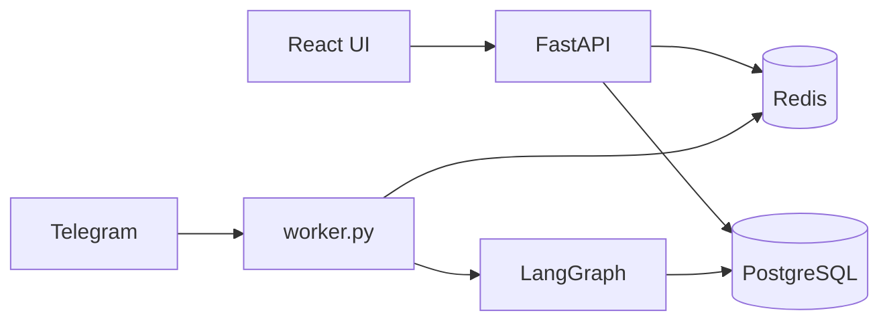

# Architecture

## Overview

The platform separates concerns into four layers:

1. **Web UI** (`frontend/`) — React + React Flow for agent and workflow management
2. **API** (`backend/app/api/`) — FastAPI REST + SSE for run events
3. **Runtime** (`backend/app/runtime/`) — LangGraph compilation and execution
4. **Persistence** (`backend/app/models/`) — PostgreSQL + Redis queue



## Why LangGraph

- **Explicit control flow**: Workflows map directly to `StateGraph` nodes and conditional edges — ideal for reviewer/revise loops.
- **Production patterns**: ReAct agents via `create_react_agent`, tool binding, and checkpoint-ready state.
- **vs CrewAI**: Less opinionated roles; easier to reflect custom graph JSON from the UI.
- **vs AutoGen**: Simpler deployment for a single-process worker + API model.

## Workflow definition format

```json
{
  "nodes": [
    { "id": "researcher", "type": "agent", "agent_id": "uuid", "is_entry": true },
    { "id": "end", "type": "end" }
  ],
  "edges": [
    { "source": "researcher", "target": "writer" },
    { "source": "reviewer", "target": "executor", "condition": true, "label": "revise" }
  ]
}
```

## Adding a workflow template

1. Add a row in `app/seed.py` under `WorkflowTemplate` with `slug`, `name`, `description`, `definition`.
2. Run `make seed` or restart API (seed runs on startup if DB is empty).

## Adding a messaging channel

1. Create `backend/app/channels/<name>.py` with inbound handler + reply logic.
2. Persist messages via `app.services.messages.persist_message`.
3. Store binding on `agent.channels` JSON, e.g. `{ "type": "slack", "team_id": "..." }`.
4. Start adapter from `worker.py` (see Telegram example).

## Token / cost tracking

`Run` and `RunStep` store token counts; `estimated_cost_usd` uses demo rates in `executor.py`. Replace with provider-specific pricing for production.
